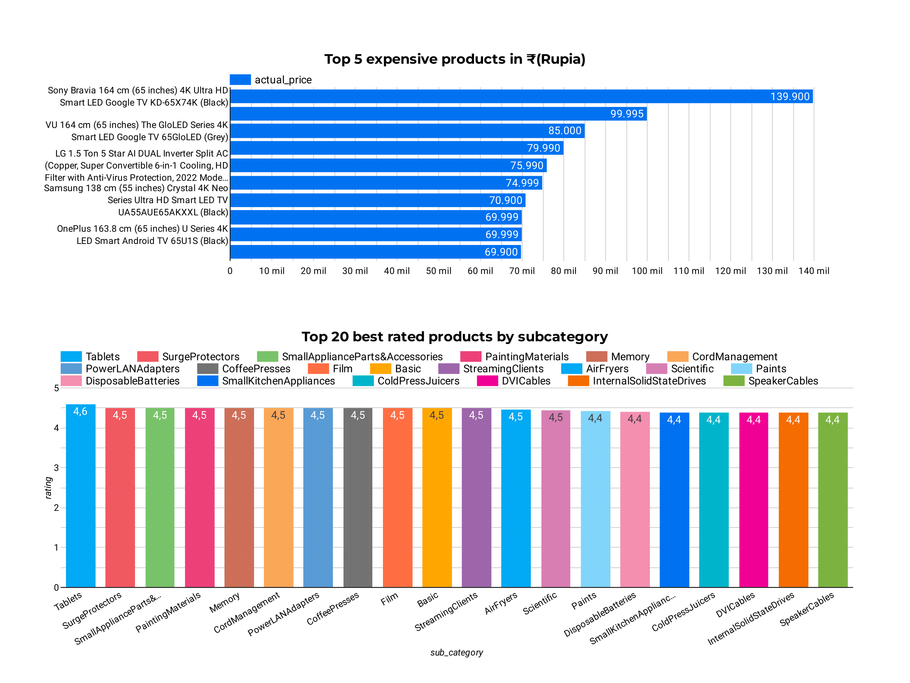

<a id="readme-top"></a>
# Amazon Products Data ETL

<div align="center">
  
  
  
  
  
  


</div>

## About the project
This project focuses on building an ETL (Extract, Transform, Load) pipeline to process and analyze Amazon products data from a CSV file as a source. Using Apache Airflow for orchestration and automation of the operations, and Supabase for database management. This project efficiently organizes data for Business Intelligence (BI) and analysis, for this we use Google Looker Studio to generate visualizations and charts based on the processed data with some attributes like `Product name`, `Categories`, `Subcategories`, `Prices`, `Ratings` and `Reviews`.

## Features
- Dataset: The dataset can be fount in the following link [here](https://www.kaggle.com/datasets/karkavelrajaj/amazon-sales-dataset), it is also included in the data/raw folder of the repository.
- ETL Pipeline Automation: Orchestrate data extraction, transformation and loading processes using Apache Airflow, containerized with Docker to simplify deployment and ensure consistency across environments.
- Data Cleansing and Transformation: Processes raw CSV data into a structured format, cleaning and preparing different attributes like `Prices`, `Discount percentage`, `Ratings`, `Ratings count`, `Category` and creating new columns like `Sub-categories`.
- Database Management: Manages storage and retrieval of transformed data, optimizing it for Business Intelligence (BI) using Supabase services with PostgreSQL as the database.
- Business Intelligence Visualizations: Generates dynamic charts and reports in Google Looker Studio for deeper insights, including visualizations of popular product categories, rating trends, pricing distributions, and discount analytics.

  <div align="center">
    
  </div>

## Getting started

- Clone the repository
  
  ```sh
  git clone https://github.com/ALEXUSCR-27/Amazon-Data-ETL.git
  cd Amazon-Data-ETL
  ```
- Config your airflow credentials in `airflow-init` configuration option in the `docker-compose` file
  ```
  _AIRFLOW_WWW_USER_USERNAME: your_username
  _AIRFLOW_WWW_USER_PASSWORD: your_password
  ```
- Build the docker container

  ```
  docker run -p 8080:8080 Dockerfile
  docker-compose up
  ```
- Access to airflow
  
    Open browser and go to `http://localhost:8080` and sign in with your credentials.
